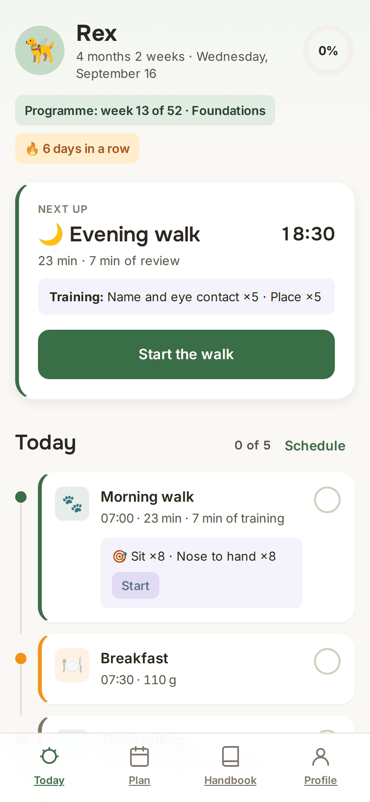
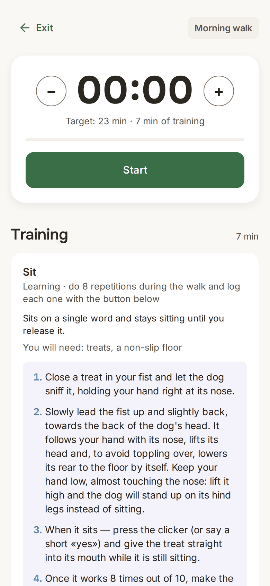
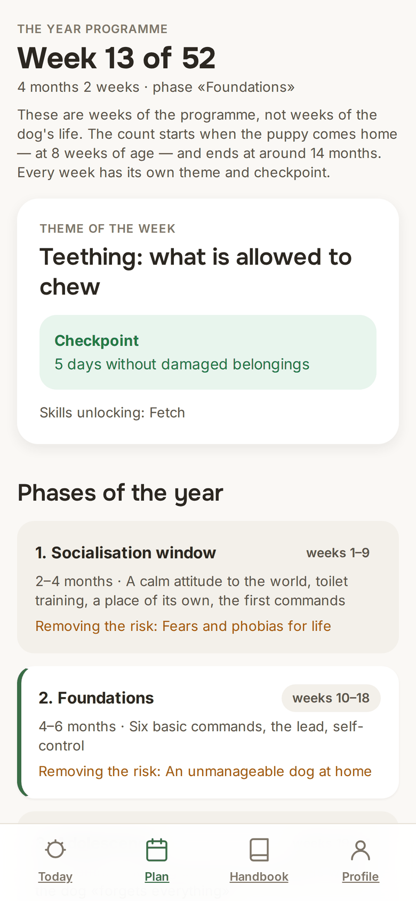
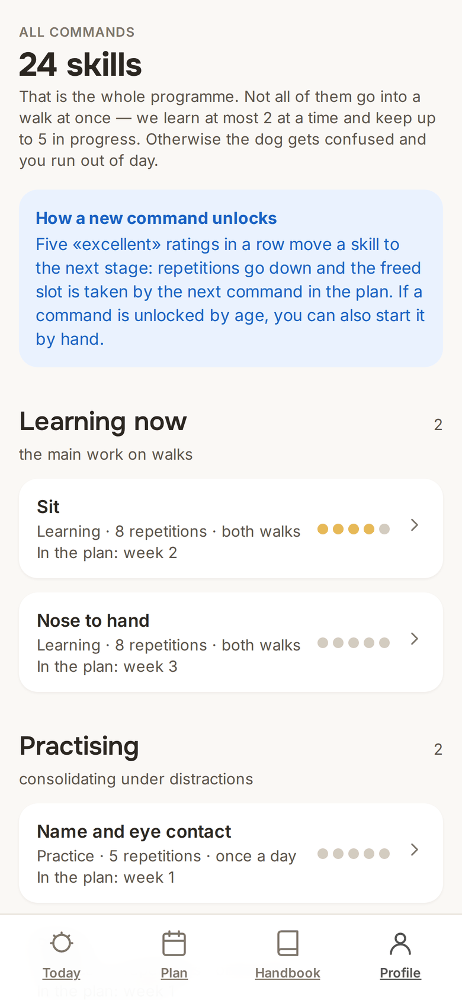
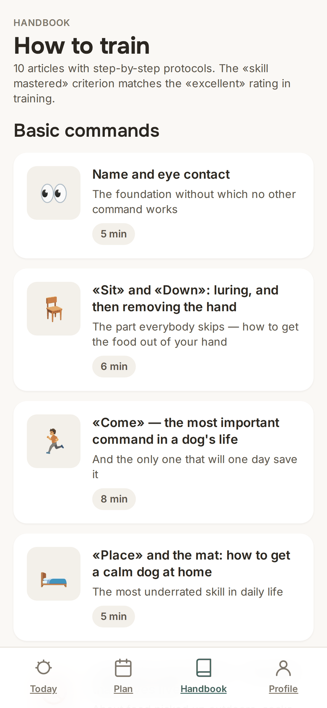
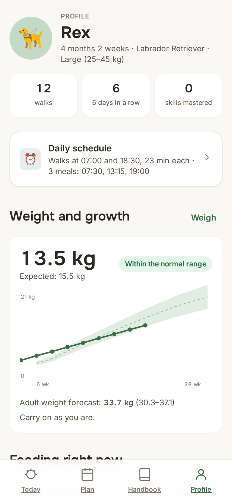

# Smart Dog — an app for raising and training a puppy

Product documentation for stage one: concept, market analysis, features, calculation
algorithms, the year-long training plan, content and the design system.

**Live app:** https://vladcherry.github.io/smart-dog/
**Demo with a filled-in profile:** https://vladcherry.github.io/smart-dog/?demo=1

> A working prototype: plain HTML + CSS + ES modules, no build step and no server.
> All data lives in the browser's localStorage.
>
> Published by GitHub Pages straight from the `main` branch, folder `/(root)`.
> There is no build: whatever sits in the repository is what gets served. The
> `.nojekyll` file turns Jekyll processing off so the static files are served as they are.

## Screenshots

| Today | The walk | The year programme |
|---|---|---|
|  |  |  |

| Skills | Handbook | Profile |
|---|---|---|
|  |  |  |

## What the product is

The owner fills in the puppy's profile (name, date of birth, breed / size group, sex,
neutering, current weight, food calories, activity level, commands already mastered) —
and **immediately**, with no manual setup, gets three connected plans:

1. **The walking plan** — how many times, at what hours and for how many minutes to walk right now.
2. **The feeding plan** — how many meals a day, at what times and how many grams.
3. **The training plan** — which commands to teach, how many repetitions and on which walk.

These plans are recalculated every week as the dog grows and according to its actual results.

## The core mechanic

- **Every walk = a walk plus a training session.** The training block is built into the walk; nothing has to be planned separately.
- **A rating after the walk (1–5).** At the end of the walk the app asks for a rating of every skill that was worked on.
- **The five-excellents rule.** Five "excellent" ratings in a row for a skill → the skill moves to the next stage,
  the number of repetitions and the frequency drop, and the freed slot is taken by a new command from the year plan's queue.

## The documents

The documents under `docs/` are written in Russian.

| Document | About |
|---|---|
| [docs/01-market-analysis.md](docs/01-market-analysis.md) | Analysis of the best apps in the category: what they do well and where the gaps are |
| [docs/02-features.md](docs/02-features.md) | The feature list with priorities (MVP / v1.1 / v2) |
| [docs/03-concept-and-screens.md](docs/03-concept-and-screens.md) | Concept, screen map, the scenario of a day, onboarding |
| [docs/04-profile-and-algorithms.md](docs/04-profile-and-algorithms.md) | The profile and every formula: weight, growth, calories, grams, walking minutes, training progression |
| [docs/05-training-year-plan.md](docs/05-training-year-plan.md) | The 52-week training plan: 5 phases, the week-by-week grid, checkpoints |
| [docs/06-schedule-and-recommendations.md](docs/06-schedule-and-recommendations.md) | The walking and feeding schedule and the "Recommendations" section |
| [docs/07-articles.md](docs/07-articles.md) | The handbook: 10 starting articles — structure and content |
| [docs/08-design-system.md](docs/08-design-system.md) | **Styles and palette**: colour, typography, grid, components, motion, dark theme |
| [docs/09-roadmap.md](docs/09-roadmap.md) | The order of implementation and the open questions |

## Installing on a phone (PWA)

The app installs to the home screen and works offline — the network is only needed for the first load.

**iPhone (Safari only; installing from Chrome on iOS is not possible):**
1. Open https://vladcherry.github.io/smart-dog/ in Safari.
2. The "Share" button (the square with an arrow pointing up) in the bottom bar.
3. Scroll the list down → **"Add to Home Screen"**.
4. Check the name (Smart Dog) → **"Add"**.

The icon appears on the home screen and the app opens without the address bar and Safari's chrome.

**Android (Chrome):** the "⋮" menu → "Install app" or "Add to Home screen".

### What installing gives you

- Its own icon and a launch in a separate window, with no browser furniture around it.
- Working with no network: the shell, all scripts and articles are cached by the service worker,
  and the data sits in localStorage anyway — a walk can be run in the woods with no signal.
- Quick actions on a long press of the icon (Android): start a walk, the plan, the handbook.

Updates arrive by themselves: on a launch with a network the service worker pulls the fresh version.

## Languages

The interface and all of the content exist in Russian, Ukrainian, English and Spanish.
The language is detected from the browser settings; a manual choice is saved in localStorage
and survives a reload. An unknown language falls back to English.

- `assets/js/i18n/index.js` — the engine: language detection, `t()`, plural forms
  via `Intl.PluralRules`, dates via `Intl.DateTimeFormat`
- `assets/js/i18n/<language>.js` — the interface dictionary; the translation key is the original Russian string
- `assets/js/i18n/content-<language>.js` — the content: skills, weeks, phases, articles, breeds
- `assets/js/i18n/content.js` — access to the content; anything missing from a translation is taken from the Russian

To add a language: create `<code>.js` and `content-<code>.js`, add the code to `LANGS`
in `i18n/index.js` and to the list of files in the offline cache in `sw.js`.

## Versions

The current version is set in `assets/js/version.js` — that is the only place where it
has to be changed. From there it is picked up by the profile screen, the name of the offline
cache and the service worker registration address (`sw.js?v=1.0.0`), so raising the version
by itself installs a new worker and clears the old cache. The history is in [CHANGELOG.md](CHANGELOG.md).

When releasing a version:

```bash
# 1. raise the number in assets/js/version.js and the build date
# 2. write the changes into CHANGELOG.md
git commit -am "release: 1.0.1"
git tag -a v1.0.1 -m "1.0.1"
git push origin main --tags
```

## Running locally

No build is needed — any static server will do (modules do not load from `file://`):

```bash
python3 -m http.server 8000
# then open http://localhost:8000/
```

## Code structure

| File | Purpose |
|---|---|
| `index.html` | The single page, hash routing |
| `assets/css/app.css` | The design system in CSS variables: palette, typography, components, dark theme |
| `assets/js/algo.js` | Every calculation: the growth curve, the weight forecast, RER/DER, grams, walking minutes, the schedule, the recommendations |
| `assets/js/training.js` | Skill stages, the five-excellents rule, the rollback, unlocking new commands |
| `assets/js/dayplan.js` | Assembling the day's feed out of the schedule, the feeding and the training |
| `assets/js/state.js` | The store in localStorage |
| `assets/js/data/` | Breeds, 24 skills, the 52 weeks of the plan, 10 articles |
| `assets/js/views/` | The screens: onboarding, today, walk, plan, handbook, schedule, profile, skill |

## Principles

1. **Positive reinforcement only.** No aversive methods, no leash corrections, no "alpha dominance".
2. **Age decides everything.** The load, the length of a session and the difficulty are tied to age and size group.
3. **Zero guilt.** A missed session is not a "failure" but an occasion to show how to catch up.
4. **We do not replace a vet.** Every calculation is a starting point, to be corrected against body condition and what the doctor says.
